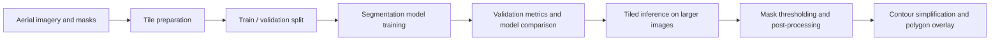

# seg2gis-buildings

Semantic segmentation pipeline for extracting building footprints from aerial imagery and preparing the predictions for GIS-style vector outputs.

This repository is a work in progress. The current version focuses on the core computer vision workflow: preparing image tiles, training segmentation models, comparing validation performance, running tiled inference over larger images, cleaning predicted masks, and drawing polygon overlays. The next phase will focus on testing augmentation strategies with the three best-performing models and improving the vectorization / polygonization step so the output is more useful in GIS workflows.

## Motivation

Building footprint extraction is a common remote-sensing task with practical relevance for urban analysis, cadastral mapping, infrastructure monitoring, and disaster response. The goal of this project is to move from aerial imagery to building masks, and then toward simplified polygon representations that can be inspected or used downstream in geospatial tools.

I am using this repository as an applied machine learning project: not only to train a segmentation model, but also to document the experimental process and build a reproducible pipeline around it.

## Current Scope

The repository currently includes:

- Dataset tiling utilities for train, validation, and test imagery.
- PyTorch training code using `segmentation_models_pytorch`.
- Support for multiple architectures and encoders, including U-Net, FPN, DeepLabV3+, and PSPNet.
- Basic experiment logging to CSV.
- Validation prediction visualizations.
- Full-image tiled inference with overlapping tiles.
- Post-processing for binary masks using connected components and morphological opening.
- Initial contour extraction and polygon overlay generation.

The project does not yet include a complete production GIS export workflow. At the moment, polygonization is still pixel-based and mainly used for visualization.

## Pipeline



## Dataset

The code is currently organized around the `AerialImageDataset` directory structure:

```text
data/
  AerialImageDataset/
    train/
      images/
      gt/
    test/
      images/
```

The tiling script creates 256 x 256 PNG tiles under:

```text
data/tiles_256/
  train/
    images/
    masks/
  val/
    images/
    masks/
  test/
    images/
```

The raw data, generated tiles, trained model weights, and output images are intentionally ignored by git.

## Experiments So Far

The current committed experiment table covers no-augmentation runs for several architecture / encoder combinations. The best validation result so far is:

| Model | Encoder | Augmentation | Epochs | Best epoch | Best validation Dice |
| --- | --- | --- | ---: | ---: | ---: |
| U-Net | EfficientNet-B3 | none | 10 | 9 | 0.8516 |

The no-augmentation results are saved in:

```text
results/experiments_noaug.csv
```

These results should be read as an initial baseline rather than a final benchmark. In the next phase, I plan to rerun the strongest models with geometric, mild color, and stronger augmentation settings to test whether the models generalize better.

## Repository Structure

```text
src/
  dataset.py        Dataset wrapper for image / mask tiles
  train.py          Training, validation, threshold tuning, experiment logging
  gis_utils.py      Model loading and tiled full-image inference helpers
  postprocess.py    Binary mask cleanup utilities
  vectorize.py      Initial contour extraction and polygon overlay utilities

scripts/
  prepare_tiles.py          Create train / validation / test tiles
  run_experiments.py        Run selected training experiments
  visualize_predictions.py  Save validation prediction grids
  compare_predictions.py    Compare several trained models visually
  predict_full_image.py     Run tiled inference on a larger image
  empty_analysis.py         Inspect empty vs non-empty mask balance
  augmentation_analysis.py  Visualize augmentation behavior

results/
  experiments_noaug.csv     Baseline no-augmentation experiment results
```

## Quickstart

Create an environment with the main Python dependencies:

```bash
pip install torch torchvision segmentation-models-pytorch albumentations opencv-python matplotlib numpy scikit-learn tqdm
```

Prepare 256 x 256 tiles:

```bash
python scripts/prepare_tiles.py
```

Train a model:

```bash
python src/train.py \
  --run_name unet_effb3_256_noaug_e10 \
  --architecture unet \
  --encoder efficientnet-b3 \
  --batch_size 8 \
  --epochs 10 \
  --lr 0.0001 \
  --augmentation_type noaug
```

Generate validation prediction grids:

```bash
python scripts/visualize_predictions.py \
  --run_name unet_effb3_256_noaug_e10 \
  --architecture unet \
  --encoder efficientnet-b3 \
  --num_samples 4
```

Run full-image tiled inference:

```bash
python scripts/predict_full_image.py \
  --image_path data/AerialImageDataset/test/images/example.tif \
  --model_path models/unet_effb3_256_noaug_e10.pth \
  --architecture unet \
  --encoder efficientnet-b3 \
  --threshold 0.5 \
  --tile_size 256 \
  --stride 128
```

## Current Limitations

- The project still uses hardcoded default paths in several scripts.
- There is no packaged environment file yet.
- There are no automated tests yet.
- The vectorization step currently extracts OpenCV contours in pixel coordinates, not CRS-aware GIS geometries.
- The current experiment table only covers the no-augmentation baseline.

## Next Phases

1. Add an environment file and make the scripts easier to reproduce on a fresh machine.
2. Run augmentation experiments with the three best-performing baseline models.
3. Improve validation reporting with plots, qualitative examples, and clearer comparison tables.
4. Improve vectorization / polygonization, including cleaner polygon boundaries and geospatial export.
5. Add lightweight tests for dataset loading, post-processing, tiled inference, and contour extraction.

## Status

WIP. The core segmentation workflow is in place, but the repository is still being shaped into a more reproducible and GIS-ready project.
