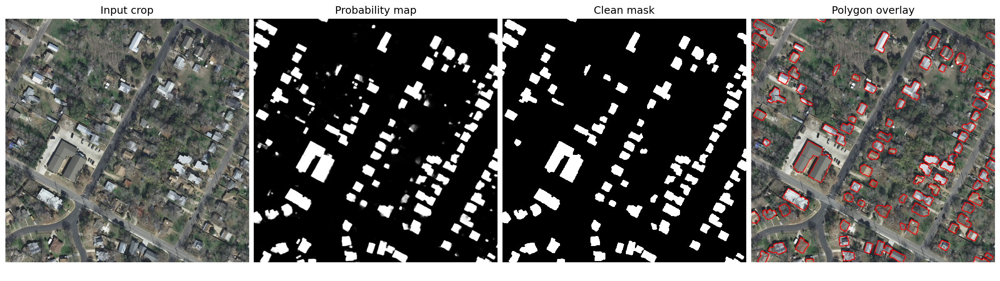

# seg2gis-buildings

Semantic segmentation pipeline for extracting building footprints from aerial imagery and converting the predictions into GIS-style polygon outputs.

The repository is organized for a final master's thesis workflow: prepare tiles, train segmentation models, compare validation metrics, evaluate full aerial images, post-process masks, and export polygon footprints. The dataset itself stays in `data/` and is not modified by the cleanup.

## Current Best Result

The current selected model is:

```text
phase2_unet_effb3_aug_boundary_bce_w2_e50
```

It is a U-Net with an EfficientNet-B3 encoder, geometric augmentation, Dice loss plus boundary-weighted BCE, trained for 50 epochs on the INRIA public holdout protocol:

| Split | Image IDs per city | Total images | Purpose |
| --- | --- | ---: | --- |
| Train | 11-36 | 130 | Model fitting |
| Validation | 6-10 | 25 | Model selection and threshold/postprocess checks |
| Test | 1-5 | 25 | Held-out reporting |

Overall full-image results for the selected model:

| Split | IoU | Dice/F1 | Precision | Recall | Accuracy | Boundary F1 @2 px | Boundary F1 @5 px |
| --- | ---: | ---: | ---: | ---: | ---: | ---: | ---: |
| Validation | 0.8016 | 0.8899 | 0.9052 | 0.8751 | 0.9666 | 0.6246 | 0.8023 |
| Test | 0.7876 | 0.8812 | 0.9064 | 0.8573 | 0.9681 | 0.6307 | 0.7981 |

Per-city Dice/F1 for the selected model:

| City | Validation | Test |
| --- | ---: | ---: |
| Austin | 0.8814 | 0.8992 |
| Chicago | 0.8540 | 0.8329 |
| Kitsap | 0.7424 | 0.8248 |
| Tyrol-w | 0.9025 | 0.8994 |
| Vienna | 0.9213 | 0.9084 |
| ALL | 0.8899 | 0.8812 |

## Result Files

All CSV result tables are now in `results/tables/`:

| File | Meaning |
| --- | --- |
| `phase1_noaugmentation_architecture_screening_initial.csv` | Original 10-epoch no-augmentation architecture/encoder screening. Best Dice@0.5: U-Net + EfficientNet-B3, 0.8516. |
| `phase1_noaugmentation_architecture_screening_legacy.csv` | Preserved older copy of the Phase 1 no-augmentation table. |
| `phase1_noaugmentation_architecture_screening_threshold_tuned.csv` | Later Phase 1 no-augmentation rerun with tuned thresholds. Best tuned Dice: FPN + EfficientNet-B3, 0.8497. |
| `phase2_augmentation_training_metrics.csv` | Augmented 50-epoch runs comparing Dice+BCE vs boundary-weighted BCE. Best tuned validation Dice: 0.8890. |
| `phase2_full_image_validation_metrics_by_city.csv` | Full-image validation metrics for the selected Phase 2 model by city and overall. |
| `phase2_full_image_test_metrics_by_city.csv` | Held-out full-image test metrics for the selected Phase 2 model by city and overall. |

Figures used in the README live in `results/figures/`. Larger generated artifacts, such as tiled prediction grids and full-image probability maps, live under `results/qualitative/` and `results/full_predictions/`; those folders are ignored by git because they are large generated outputs.

## Visual Examples

Example full-image inference output from the baseline U-Net + EfficientNet-B3 workflow:



Full-scene mask and polygon overlay from the same baseline run:

| Clean building mask | Polygon overlay |
| --- | --- |
|  |  |

Phase 1 no-augmentation model comparison on one validation tile:


## Repository Structure

```text
configs/
  default.json
  experiments_phase1_noaug_baseline.yaml
  experiments_phase2_augmentation_boundary_loss.yaml
  generated/
    phase1/
    phase2_augmentation/
    archive_phase3_loss_comparison/

data/
  AerialImageDataset/
  tiles_256_inria155/

docs/
  presentation/

models/
  phase1/
  phase2_augmentation/

results/
  tables/
  figures/
  full_predictions/
  qualitative/

scripts/
  prepare_tiles.py
  run_experiments.py
  predict_full_image.py
  tune_postprocess.py
  sanity_check_boundary_metrics.py

src/
  config.py
  dataset.py
  train.py
  evaluate.py
  metrics.py
  losses.py
  models.py
  gis_utils.py
  postprocess.py
  vectorize.py
  transforms.py
```

The important convention is:

- `data/` is the dataset and generated tiles. Do not clean or reorganize it as part of repo housekeeping.
- `results/tables/` is the source of truth for result CSVs.
- `results/figures/` contains small, curated figures that are useful for documentation.
- `results/full_predictions/` and `results/qualitative/` contain large generated result artifacts and are ignored by git.
- `docs/presentation/` contains presentation source files, deck files, build artifacts, and asset-generation scripts.

## Environment Setup

This project is currently configured for the local conda environment named `cv`.

Use:

```powershell
conda activate cv
```

Python interpreter:

```text
C:\Users\rlyeh\miniconda3\envs\cv\python.exe
```

Install or refresh dependencies with:

```powershell
C:\Users\rlyeh\miniconda3\envs\cv\python.exe -m pip install -r requirements.txt
```

On Windows, the geospatial stack can be easier through conda-forge:

```powershell
conda activate cv
conda install -c conda-forge rasterio shapely geopandas
```

## Dataset

The code expects the INRIA-style aerial image dataset under:

```text
data/AerialImageDataset/
  train/
    images/
    gt/
  test/
    images/
```

Prepared tiles are expected under:

```text
data/tiles_256_inria155/
  train/
    images/
    masks/
  val/
    images/
    masks/
  test/
    images/
    masks/
```

## Reproduce The Workflow

Run commands from the repository root.

Prepare tiles:

```powershell
conda activate cv
python scripts/prepare_tiles.py --config configs/default.json
```

Run the Phase 1 no-augmentation screening:

```powershell
conda activate cv
python scripts/run_experiments.py --experiments_config configs/experiments_phase1_noaug_baseline.yaml
```

Run the Phase 2 augmented boundary-loss comparison:

```powershell
conda activate cv
python scripts/run_experiments.py --experiments_config configs/experiments_phase2_augmentation_boundary_loss.yaml
```

Evaluate the selected model on full validation images:

```powershell
conda activate cv
python src/evaluate.py --config configs/generated/phase2_augmentation/phase2_unet_effb3_aug_boundary_bce_w2_e50.json --split val
```

Evaluate the selected model on held-out full test images:

```powershell
conda activate cv
python src/evaluate.py --config configs/generated/phase2_augmentation/phase2_unet_effb3_aug_boundary_bce_w2_e50.json --split test
```

Run full-image inference and polygon export:

```powershell
conda activate cv
python scripts/predict_full_image.py --config configs/generated/phase2_augmentation/phase2_unet_effb3_aug_boundary_bce_w2_e50.json --image_path data/AerialImageDataset/train/images/austin1.tif --model_path models/phase2_augmentation/phase2_unet_effb3_aug_boundary_bce_w2_e50.pth --output_name austin1_phase2_unet_effb3_aug_boundary_bce_w2_e50
```

Prediction outputs are written to `results/full_predictions/` by default:

```text
<name>_prob.npy
<name>_prob.png
<name>_mask.png
<name>_clean_mask.png
<name>_polygons_overlay.png
<name>_showcase_crop.png
<name>_buildings.geojson
```

GeoJSON export uses the source raster transform and CRS. Area filtering expects a projected CRS. If a raster is in a geographic CRS, either reproject it first, set `--vector_min_area 0`, or pass `--allow_geographic_area` only when square-degree area filtering is intentional.

## Presentation Materials

Presentation material is grouped under `docs/presentation/`:

- `thesis_presentation_source.md` is the source deck text.
- `from_aerial_segmentation_to_gis_footprints.pptx` is the current deck.
- `assets/` contains the images used in the slides.
- `scripts/asset_generation/` contains the scripts used to build slide assets.
- `builds/` contains generated presentation build outputs.

## Current Limitations

- The segmentation results are strong enough for thesis reporting, but the vectorized polygons still need quality analysis before being described as production-ready GIS footprints.
- The current best full-image evaluation uses threshold `0.5`, postprocess `min_area=500`, and morphological opening kernel size `5`.
- Heavy local artifacts are preserved in `results/`, but ignored by git to keep the repository lightweight.

## License

This project is licensed under the MIT License. See [LICENSE](LICENSE).
