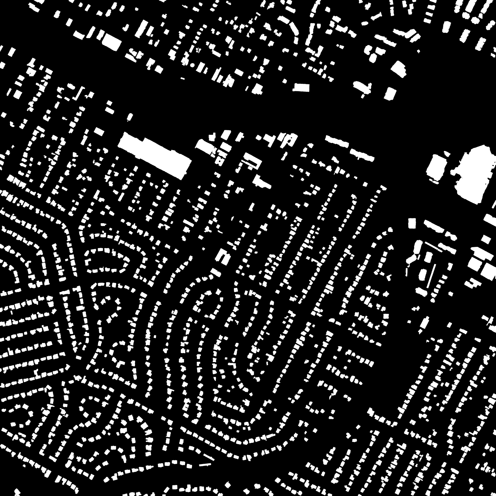
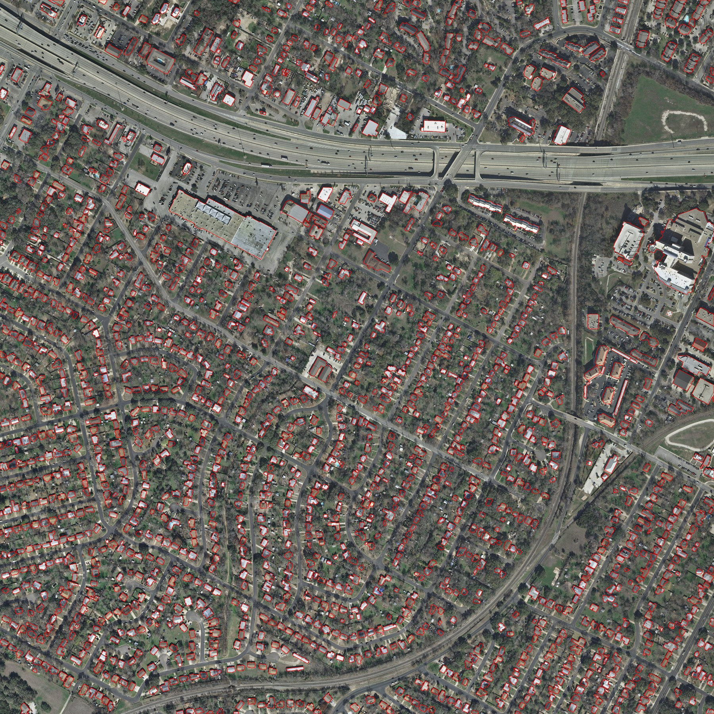
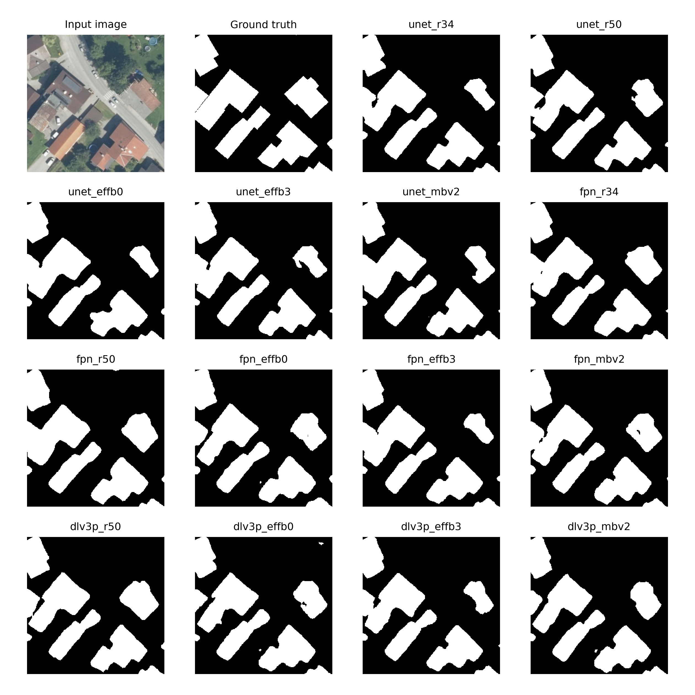
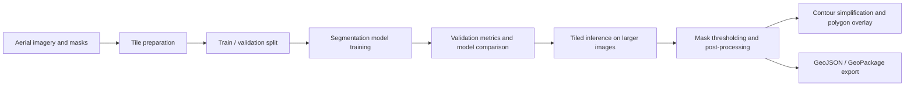

# seg2gis-buildings

Semantic segmentation pipeline for extracting building footprints from aerial imagery and preparing the predictions for GIS-style vector outputs.

This repository is a work in progress. The current version focuses on the core computer vision workflow: preparing image tiles, training segmentation models, comparing validation performance, running tiled inference over larger images, cleaning predicted masks, and drawing polygon overlays. The next phase will focus on testing the standard geometric augmentation recipe with the three best-performing models and improving the vectorization / polygonization step so the output is more useful in GIS workflows.

## Motivation

Building footprint extraction is a common remote-sensing task with practical relevance for urban analysis, cadastral mapping, infrastructure monitoring, and disaster response. The goal of this project is to move from aerial imagery to building masks, and then toward simplified polygon representations that can be inspected or used downstream in geospatial tools.

I am using this repository as an applied machine learning project: not only to train a segmentation model, but also to document the experimental process and build a reproducible pipeline around it.

## Current Scope

The repository currently includes:

- Dataset tiling utilities for train, validation, and test imagery.
- PyTorch training code using `segmentation_models_pytorch`.
- Support for multiple architectures and encoders, including U-Net, FPN, DeepLabV3+, and PSPNet.
- Basic experiment logging to CSV.
- Validation prediction visualizations.
- Full-image tiled inference with overlapping tiles.
- Post-processing for binary masks using connected components and morphological opening.
- Initial contour extraction and polygon overlay generation.
- GeoJSON and GeoPackage export using source raster transform / CRS.

The project does not yet include a complete production GIS workflow. The current vector export is a first georeferenced polygonization pass and still needs more work on polygon quality, topology, and validation.

## Visual Proof

Example full-image inference output from the current U-Net + EfficientNet-B3 baseline:


The figure shows an aerial crop, model probability map, post-processed binary mask, and polygon overlay. This is meant as a qualitative snapshot of the current WIP pipeline rather than a final GIS-quality footprint product.

Full-scene mask and polygon overlay from the same inference run:

| Clean building mask | Polygon overlay |
| --- | --- |
|  |  |

Phase 1 model comparison on one validation tile:



This grid compares the input image and ground truth against predictions from all 14 no-augmentation baseline models.

## Pipeline



## Dataset

The code is currently organized around the `AerialImageDataset` directory structure:

```text
data/
  AerialImageDataset/
    train/
      images/
      gt/
    test/
      images/
```

The tiling script creates 256 x 256 PNG tiles under:

```text
data/tiles_256/
  train/
    images/
    masks/
  val/
    images/
    masks/
  test/
    images/
```

The raw data, generated tiles, trained model weights, and output images are intentionally ignored by git.

## Experiments So Far

The current committed experiment table covers no-augmentation runs for several architecture / encoder combinations. The best validation result so far is:

| Model | Encoder | Augmentation | Epochs | Best epoch | Best validation Dice |
| --- | --- | --- | ---: | ---: | ---: |
| U-Net | EfficientNet-B3 | none | 10 | 9 | 0.8516 |

The Phase 1 no-augmentation baseline results are saved in:

```text
results/experiments_phase1_noaug_baseline.csv
```

These results should be read as an initial baseline rather than a final benchmark. Phase 2 experiment logs will be written to:

```text
results/experiments_phase2_augmentation.csv
```

In the next phase, I plan to rerun the strongest models with the standard geometric augmentation setting to test whether the models generalize better.

## Repository Structure

```text
src/
  config.py         Small JSON config loader used by scripts
  dataset.py        Dataset wrapper for image / mask tiles
  train.py          Training, validation, threshold tuning, experiment logging
  evaluate.py       Full-image validation/test evaluation
  metrics.py        Reusable confusion-matrix metric helpers
  gis_utils.py      Model loading and tiled full-image inference helpers
  postprocess.py    Binary mask cleanup utilities
  vectorize.py      Contour extraction, polygon overlay, and geospatial vector export utilities

configs/
  default.json      Default data paths, model settings, training settings, and inference settings
  experiments_phase1_noaug_baseline.yaml  Phase 1 baseline experiment runner config
  experiments_phase2_augmentation.yaml    Phase 2 augmentation experiment runner config

scripts/
  prepare_tiles.py          Create train / validation / test tiles
  run_experiments.py        Run selected training experiments
  predict_full_image.py     Run tiled inference on a larger image

results/
  experiments_phase1_noaug_baseline.csv  Baseline no-augmentation experiment results
  experiments_phase2_augmentation.csv    Augmentation experiment log for the next phase

images/
  austin1_unet_effb3_clean_mask.png      Full-scene cleaned mask example
  austin1_unet_effb3_polygons_overlay.jpg Full-scene polygon overlay example
  building_footprint_showcase.png        README visual example
  phase1_noaug_model_comparison.png      Phase 1 model comparison example
```

## Environment Setup

Recommended Python version: Python 3.10 or 3.11.

This project can run on CPU, but training segmentation models is much more practical with a CUDA-capable GPU. The dependency ranges in `requirements.txt` are bounded so the code runs against compatible library APIs without requiring an export of a local machine-specific environment.

Create and activate a virtual environment:

```bash
python -m venv .venv
```

On Windows PowerShell:

```bash
.venv\Scripts\Activate.ps1
```

On macOS / Linux:

```bash
source .venv/bin/activate
```

Install dependencies:

```bash
python -m pip install --upgrade pip
python -m pip install -r requirements.txt
```

If you are using a CUDA-capable GPU, install the PyTorch / torchvision build that matches your CUDA version first, using the command from the official PyTorch installation selector. Then install the remaining dependencies:

```bash
python -m pip install -r requirements.txt
```

On Windows, the geospatial stack is often more reliable through conda-forge. In that case, create or activate a conda environment and install the GIS packages from conda-forge before installing the remaining Python packages:

```bash
conda install -c conda-forge rasterio shapely geopandas
python -m pip install -r requirements.txt
```

CUDA note: if `pip install -r requirements.txt` installs a CPU-only PyTorch build, reinstall PyTorch and torchvision with the CUDA wheel recommended for your system, then rerun the requirements command if needed.

Check that Python can import the main libraries:

```bash
python -c "import torch, cv2, albumentations, segmentation_models_pytorch; print('torch:', torch.__version__); print('cuda available:', torch.cuda.is_available())"
```

## Configuration

Most project defaults are kept in:

```text
configs/default.json
```

The config stores the main data paths, tiling settings, model architecture, encoder, training settings, evaluation settings, inference threshold, tile size, stride, vector export settings, and output directories. Training reads these values from JSON only; experiment YAML files override the base JSON through `scripts/run_experiments.py`.

For example, this uses the default config:

```bash
python src/train.py
```

To use another config file:

```bash
python src/train.py --config configs/my_experiment.json
```

## Quickstart

The scripts assume the raw dataset is available under:

```text
data/AerialImageDataset/
```

Prepare 256 x 256 tiles:

```bash
python scripts/prepare_tiles.py --config configs/default.json
```

Train a model:

```bash
python src/train.py --config configs/default.json
```

Run full-image validation evaluation for model selection and ablations:

```bash
python src/evaluate.py --config configs/default.json --split val
```

Run final held-out full-image test evaluation:

```bash
python src/evaluate.py --config configs/default.json --split test
```

Run a batch of experiments from a YAML file:

```bash
python scripts/run_experiments.py \
  --experiments_config configs/experiments_phase2_augmentation.yaml
```

Preview the generated commands without starting training:

```bash
python scripts/run_experiments.py \
  --experiments_config configs/experiments_phase1_noaug_baseline.yaml \
  --dry_run
```

Run full-image tiled inference:

```bash
python scripts/predict_full_image.py \
  --config configs/default.json \
  --image_path data/AerialImageDataset/test/images/example.tif \
  --model_path models/unet_effb3_256_noaug_e10.pth
```

This writes raster-style prediction outputs, a showcase crop, a polygon overlay, and GIS vector outputs:

```text
outputs/full_predictions/
  <name>_prob.npy
  <name>_prob.png
  <name>_mask.png
  <name>_clean_mask.png
  <name>_polygons_overlay.png
  <name>_showcase_crop.png
  <name>_buildings.geojson
  <name>_buildings.gpkg
```

The GeoJSON and GeoPackage files use the input raster's transform and CRS through `rasterio`, `shapely`, and `geopandas`. Vector area filtering expects a projected CRS so polygon areas are measured in linear CRS units, such as square meters. If the source raster uses a geographic CRS, the export raises an error before applying `vector_min_area`; reproject first, set `--vector_min_area 0`, or use `--allow_geographic_area` only when square-degree area filtering is intentional.

Vector export can be disabled with:

```bash
python scripts/predict_full_image.py \
  --config configs/default.json \
  --image_path data/AerialImageDataset/test/images/example.tif \
  --no_export_vectors
```

## Current Limitations

- Phase 2 experiment and visualization defaults are config-driven, but the next results table has not been populated yet.
- The geospatial vector export is CRS-aware and guards against accidental area filtering in geographic CRS, but polygon boundaries still need quality improvements before being treated as production-grade footprints.
- The current experiment table only covers the no-augmentation baseline.

## Next Phases

1. Run standard geometric augmentation experiments with the three best-performing baseline models.
2. Improve validation reporting with plots, qualitative examples, and clearer comparison tables.
3. Improve vectorization / polygonization, including cleaner polygon boundaries and geospatial export.
4. Add smoke tests for config loading, tiling, post-processing, and vector export.

## Status

WIP. The core segmentation workflow is in place, but the repository is still being shaped into a more reproducible and GIS-ready project.

## License

This project is licensed under the MIT License. See [LICENSE](LICENSE).
